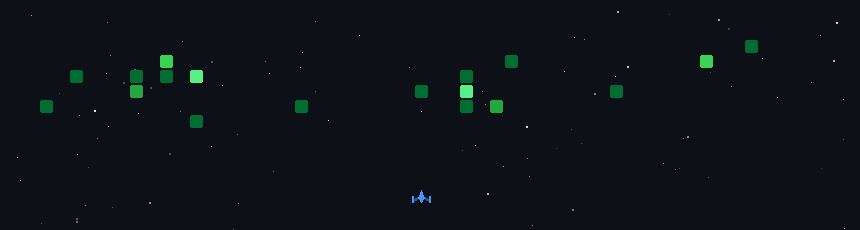

# Hi there 👋, I'm YuTing

🎓 ECNU CS Postgraduate  
📍 Shanghai, China  
🌐 Blog: [yuting0907.github.io](https://yuting0907.github.io)

---

## About Me

I am interested in AI applications, data engineering, OCR, LLM Agents, and image aesthetics assessment.

My GitHub mainly records my learning notes, research projects, engineering practice, and some fun automation tools.  
I enjoy turning ideas into usable tools, especially combining AI capabilities with real-world workflows.

---

## What I'm Working On

- 🔍 OCR and document/image understanding
- 🧠 RAG systems and vector search
- 🤖 LLM Agents, MCP Server, and AI workflow automation
- 📊 Data engineering, BI search, and attribution analysis
- 🖼️ Image aesthetics assessment and personalized image quality evaluation

---

## Featured Projects

### 🔔 SubscribePapers

A Python project for paper subscription and tracking.  
Useful for keeping up with research topics and new papers.

### 🖼️ ImageAestheticsAssessment

Research project on image aesthetic quality assessment.  
Focuses on natural image aesthetics, artistic image aesthetics, and personalized image aesthetics.

### ✨ BeACodeContributor

An LLM-powered tool that helps developers analyze GitHub Issues, generate solution ideas, and receive notifications through Feishu.

### 📅 bond-calendar-notify

A small automation tool for daily convertible bond calendar notifications.

### 🌐 YUTING0907.github.io

My personal blog and project showcase site.

---

## Tech Stack

### Languages

### AI & Data

### Engineering

---

## GitHub Stats

---

## 2026 TODO

- [ ] Improve OCR pipelines for complex background documents
- [ ] Build practical RAG applications with vector databases
- [ ] Explore MCP Server and Agent-based workflows
- [ ] Implement AI-assisted code review and issue analysis
- [ ] Enhance BI platform search and data analysis experience
- [ ] Keep writing, building, and sharing

---

## Contact

- Blog: [https://yuting0907.github.io](https://yuting0907.github.io)
- GitHub: [@YUTING0907](https://github.com/YUTING0907)

---

> Keep learning. Keep building. Keep shipping.
